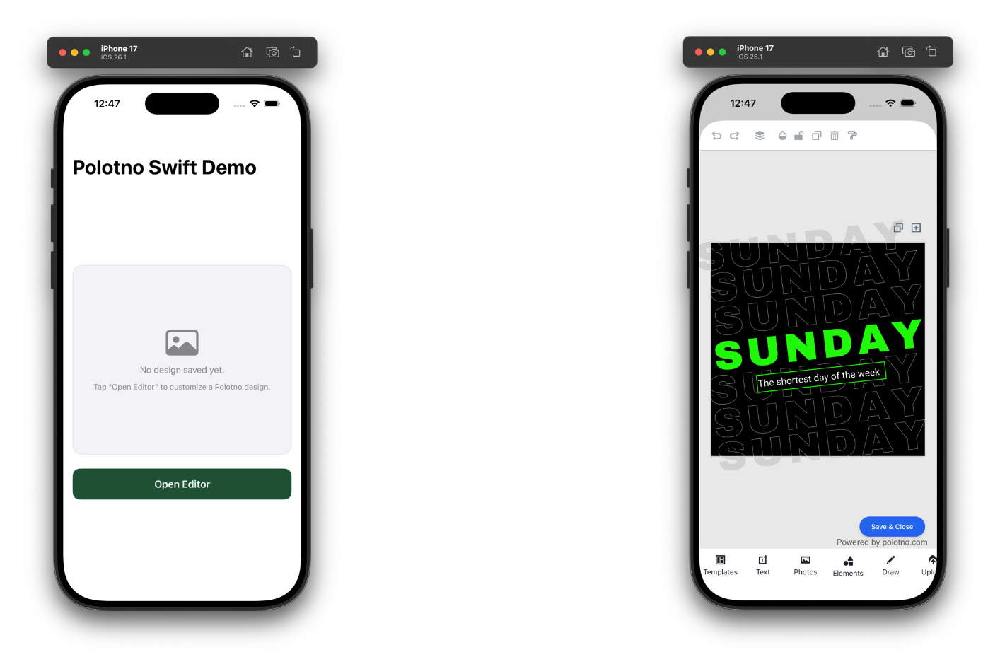

# Polotno Swift Demo



Native SwiftUI sample app that launches an embedded Polotno editor (React + Vite) inside a `WKWebView`. The app passes JSON design data to the web editor, listens for a save event, and renders the returned preview image in SwiftUI.

## Prerequisites

- Xcode 15+ (iOS 16 deployment target)
- Node.js 18+ and npm

## Project layout

| Path                     | Description                                             |
| ------------------------ | ------------------------------------------------------- |
| `PolotnoSwift/`          | SwiftUI sources, assets, Info.plist, bundled web editor |
| `PolotnoSwift.xcodeproj` | Xcode project ready to open/run                         |
| `web-editor/`            | Vite React app that hosts the Polotno editor            |

## Building the embedded editor

```bash
cd ./web-editor
npm install
npm run build:ios
```

`npm run build:ios` runs `vite build` and copies the output into `PolotnoSwift/Editor/` so Xcode bundles the latest editor.

> **Note:** Make sure to use valid API key for creating polotno store in `App.jsx`

## Running the iOS app

1. Open `PolotnoSwift.xcodeproj` in Xcode.
2. Select an iOS 16+ simulator or device.
3. Build & run.
4. Tap **Open Editor** to launch the embedded Polotno editor. After tapping **Save & Close**, the editor posts `{ docJson, previewBase64 }` back to Swift via `window.webkit.messageHandlers.editor`. The sheet dismisses and the SwiftUI view renders the returned PNG.

## How it works

The solution is a hybrid application that embeds a web-based editor into a native iOS context.

### WebView Configuration

- **WKWebView**: The core component is a `WKWebView` configured to load local content (`EditorWebView.swift`).
- **Single-File Bundle**: The React app is built using `vite-plugin-singlefile`, which inlines all JS and CSS into a single `index.html`. This prevents module loading errors and cross-origin issues common with local file loading in WKWebView.
- **Viewport**: The web page is configured with `user-scalable=no` to prevent zooming and provide a native app feel.

### Online Requirement

While the editor code is bundled locally, Polotno relies on external APIs for certain assets (stock photos, templates, fonts, etc.). The device must be online for these features to work properly.

> **Note for Enterprise Clients**: Full offline support (bundling all assets and fonts) is available for enterprise licenses. Contact support for details.

### Limitations

- **Memory**: High-resolution exports or complex designs may consume significant memory; test on older devices if targeting a broad user base.

## Data flow

1. Swift keeps the latest design JSON (`currentDocJSON`) and passes it to the web view.
2. `EditorWebView` injects that JSON into the page via `window.__polotnoReceiveInitialDoc(atob(...))`.
3. The React app’s `nativeBridge` module loads the JSON into the Polotno store and exposes a `saveToNative` helper.
4. When the Save button is pressed, the editor serializes the store, rasterizes a PNG preview, and posts it back to Swift.
5. Swift decodes the payload, updates local state, and reuses the returned JSON next time the editor opens.

## Customization ideas

- Replace `SampleDocument.defaultJSON` (Swift) or `sample-doc.json` (web) with your domain data.
- Update the React UI inside `web-editor/src/App.jsx` to add your own panels, presets, or save flows.
- Extend `EditorWebView` to support additional message types (export PDF, track analytics, etc.).
